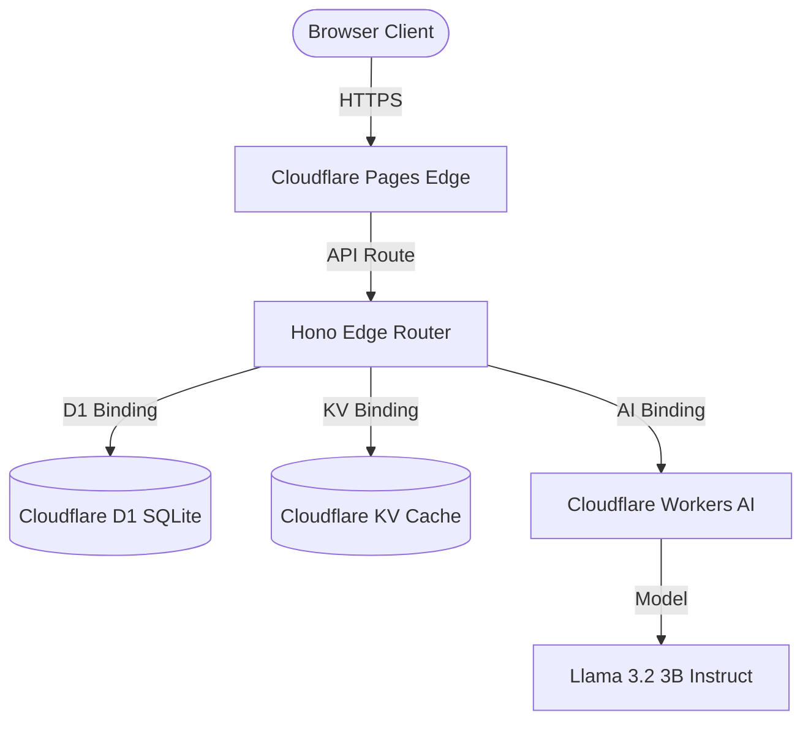

# 🏗️ TECHNICAL BLUEPRINT & SYSTEM SCHEMA
**Contracting Preacher Core Architecture**

---

## 1. System Topology
The Contracting Preacher platform is engineered as a high-performance edge web application built natively on **Cloudflare Pages**:



## 2. Relational Entity Schema (D1 SQL)
The local and production SQL schemas are structured to manage CRM leads, drafted documents, and compliance audit logs:

### `leads` Table
Stores prequalified small businesses, socio-economic flags, and revenue indicators:
```sql
CREATE TABLE leads (
    id TEXT PRIMARY KEY,
    name TEXT NOT NULL,
    email TEXT NOT NULL,
    phone TEXT,
    company TEXT,
    revenue REAL,
    is_minority INTEGER DEFAULT 0,
    is_woman INTEGER DEFAULT 0,
    is_veteran INTEGER DEFAULT 0,
    is_disabled_veteran INTEGER DEFAULT 0,
    is_hubzone INTEGER DEFAULT 0,
    created_at TEXT DEFAULT CURRENT_TIMESTAMP
);
```

### `drafts` Table
Maintains historical, AI-generated technical volumes and capability drafts:
```sql
CREATE TABLE drafts (
    id TEXT PRIMARY KEY,
    opportunity_id TEXT,
    client_id TEXT,
    title TEXT,
    content TEXT,
    created_at TEXT DEFAULT CURRENT_TIMESTAMP
);
```

### `audits` Table
Logs historical compliance audits, detailing FAR clauses, risks, and scoring:
```sql
CREATE TABLE audits (
    id TEXT PRIMARY KEY,
    draft_id TEXT,
    score REAL,
    findings TEXT,
    created_at TEXT DEFAULT CURRENT_TIMESTAMP
);
```

## 3. Algorithm: Compliance Evaluation
The AI Agent utilizes a weighted scoring matrix to analyze bid compliance before submission:
```
Compliance Score = (0.4 * Technical Compliance) 
                 + (0.3 * FAR Clause Compliance) 
                 + (0.2 * Past Performance Mapping) 
                 + (0.1 * Administrative Completeness)
```
